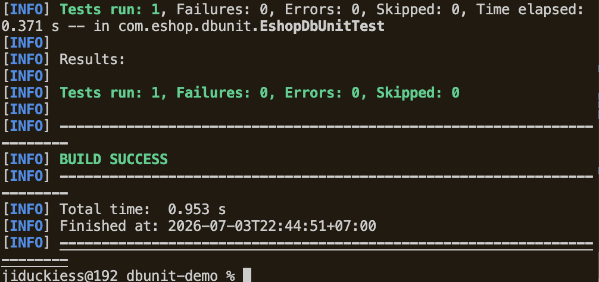
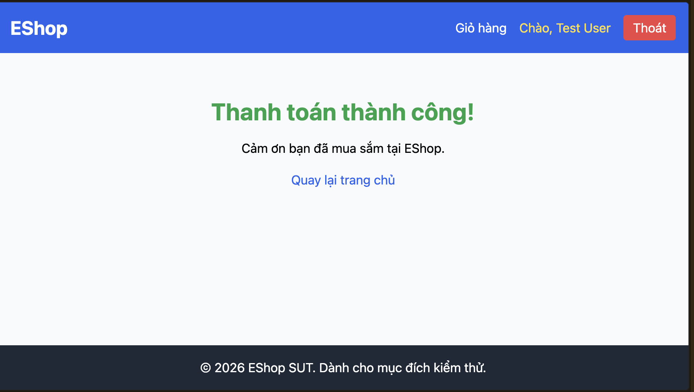
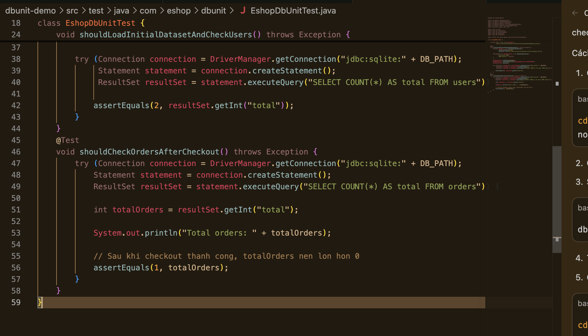
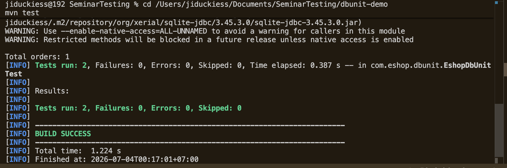
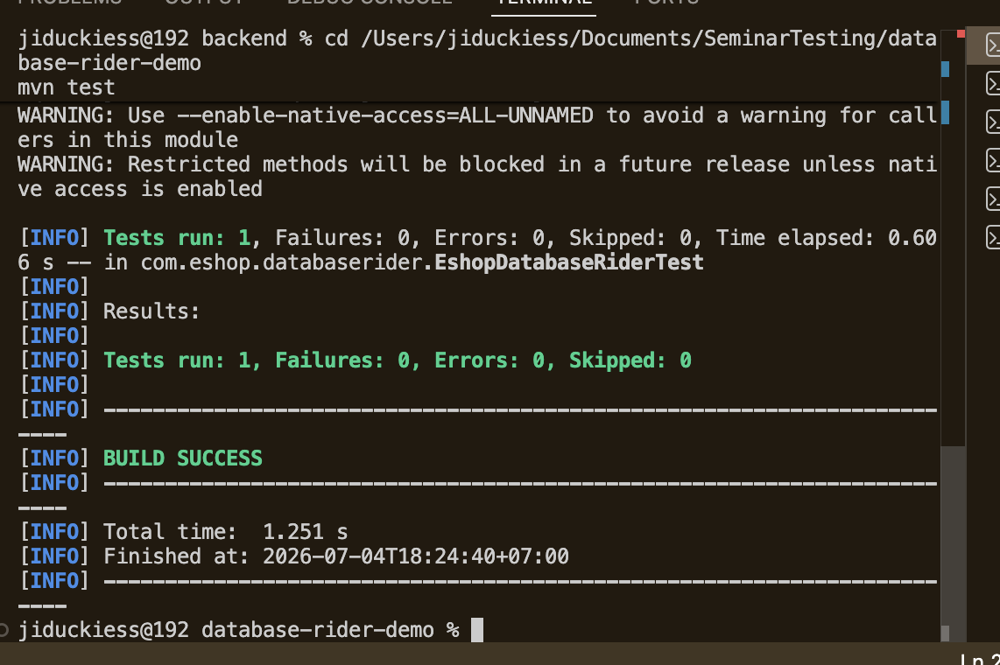
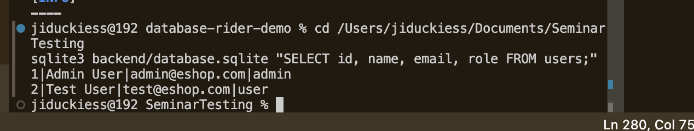

# Báo cáo kiểm thử cơ sở dữ liệu cho EShop

Ngày: 2026-07-19

## 1. Giới thiệu

Kiểm thử cơ sở dữ liệu rất quan trọng vì nhiều lỗi ứng dụng không chỉ xuất hiện
trên giao diện. Lỗi có thể xảy ra khi dữ liệu được lưu, cập nhật, xóa hoặc kiểm
tra trong cơ sở dữ liệu.

Hệ thống được kiểm thử trong seminar là dự án EShop tại
https://github.com/ttbhanh/eshop-sut

EShop phù hợp để minh họa vì đây là một ứng dụng thương mại điện tử điển hình,
bao gồm người dùng, sản phẩm, danh mục, mã giảm giá, giỏ hàng, đơn hàng và chức
năng quản trị. Tất cả chức năng này đều phụ thuộc vào tính chính xác của dữ liệu.

Ba công cụ được nghiên cứu trong báo cáo:

- DbUnit
- Database Rider
- Tonic.ai

Mục tiêu chính là tìm hiểu cách các công cụ này giúp chuẩn bị dữ liệu kiểm thử,
kiểm tra kết quả trong cơ sở dữ liệu và tạo dữ liệu kiểm thử an toàn hơn.

## 2. Tổng quan công cụ

| Công cụ | Mục đích chính | Trường hợp sử dụng |
| --- | --- | --- |
| DbUnit | Thiết lập trạng thái cơ sở dữ liệu bằng dataset và kiểm tra dữ liệu | Kiểm thử đơn vị và kiểm thử tích hợp cơ sở dữ liệu |
| Database Rider | Giúp viết và duy trì kiểm thử kiểu DbUnit dễ hơn | Kiểm thử cơ sở dữ liệu bằng annotation và YAML |
| Tonic.ai | Tạo hoặc che dữ liệu nhạy cảm | Quản lý dữ liệu kiểm thử an toàn |

### DbUnit

DbUnit là thư viện kiểm thử dành cho Java. Công cụ có thể nạp dataset vào cơ sở
dữ liệu trước khi test chạy. Sau khi thực hiện hành động, test có thể kiểm tra cơ
sở dữ liệu có chứa dữ liệu mong đợi hay không.

Trong demo, DbUnit sử dụng dataset XML.

### Database Rider

Database Rider được xây dựng trên DbUnit. Công cụ cung cấp annotation và cách
cấu hình gọn hơn để viết database test. Dataset YAML thường dễ đọc và chỉnh sửa
hơn XML.

Trong demo, Database Rider sử dụng dataset YAML.

### Tonic.ai

Tonic.ai khác DbUnit và Database Rider. Đây không phải công cụ assertion chính.
Tonic được dùng để tạo hoặc che dữ liệu phục vụ kiểm thử.

Đối với EShop, điều này hữu ích vì bảng `users` có thể chứa tên, email, mật khẩu,
số điện thoại và địa chỉ giao hàng. Đây đều là dữ liệu không nên đưa trực tiếp
vào môi trường demo hoặc test nếu lấy từ người dùng thật.

## 3. So sánh kiểm thử database SQL và NoSQL

Kiểm thử database SQL và NoSQL đều có cùng mục tiêu: chuẩn bị dữ liệu test, chạy
hành động của ứng dụng, kiểm tra dữ liệu được lưu đúng, rồi dọn dữ liệu test.
Điểm khác nhau là cách dữ liệu được tổ chức.

SQL thường dùng bảng, hàng và cột. Ví dụ bảng `users` lưu người dùng, bảng
`orders` lưu đơn hàng. NoSQL có nhiều kiểu hơn, ví dụ document database như
MongoDB lưu dữ liệu dưới dạng document gần giống JSON.

### 3.1 Kiểm thử database SQL

Với SQL database, tester thường kiểm tra:

1. Bảng và cột có đúng kiểu dữ liệu không.
2. Khóa chính và khóa ngoại có bảo vệ quan hệ dữ liệu không.
3. Thao tác thêm, sửa, xóa và truy vấn có đúng không.
4. `JOIN` có lấy đúng dữ liệu từ nhiều bảng không.
5. Transaction có lưu hoặc hủy dữ liệu đúng không.
6. Index có giúp truy vấn nhanh hơn không.

Ví dụ trong EShop, `orders.user_id` phải trỏ tới một user thật trong bảng
`users`. Nếu đơn hàng trỏ tới user không tồn tại, dữ liệu bị sai.

### 3.2 Kiểm thử database NoSQL

Với NoSQL database, các bước kiểm thử thường là:

1. Xác định loại NoSQL đang dùng, ví dụ document, key-value hoặc graph.
2. Chuẩn bị dữ liệu test bằng document hoặc key mẫu.
3. Kiểm tra các field bắt buộc có tồn tại không.
4. Kiểm tra kiểu dữ liệu, ví dụ `price` phải là số và `email` phải là chuỗi.
5. Kiểm tra dữ liệu lồng nhau, ví dụ một đơn hàng có danh sách sản phẩm bên trong.
6. Kiểm tra quan hệ do ứng dụng quản lý, vì nhiều NoSQL database không có foreign key.
7. Kiểm tra query và aggregation có trả đúng kết quả không.
8. Kiểm tra update có làm mất field cũ hoặc ghi sai document không.
9. Kiểm tra consistency sau khi ghi dữ liệu.
10. Kiểm tra dữ liệu sau khi đổi schema, vì document cũ và document mới có thể
    cùng tồn tại.

Ví dụ với MongoDB, một test có thể tạo document user, tạo document order, chạy
checkout, rồi kiểm tra collection `orders` có order mới với đúng `userId`,
`totalAmount` và `status`.

### 3.3 Khác biệt chính

| Nội dung | SQL database | NoSQL database |
| --- | --- | --- |
| Cách lưu dữ liệu | Bảng, hàng, cột | Document, key-value, graph hoặc wide-column |
| Schema | Thường cố định và rõ ràng | Linh hoạt hơn, có thể khác nhau giữa các document |
| Quan hệ dữ liệu | Thường dùng foreign key và `JOIN` | Thường dùng dữ liệu lồng nhau hoặc reference |
| Transaction | Phổ biến và mạnh | Có nhưng tùy loại database và phạm vi thao tác |
| Kiểm tra chính | Row, constraint, `JOIN`, transaction | Document shape, field, query, consistency |
| Rủi ro thường gặp | Sai quan hệ bảng, sai constraint | Thiếu field, sai kiểu dữ liệu, document cũ và mới khác nhau |

### 3.4 Khả năng áp dụng của công cụ

| Công cụ | Dùng với SQL database | Dùng với NoSQL database |
| --- | --- | --- |
| DbUnit | Phù hợp, vì làm việc tốt với JDBC và dữ liệu dạng bảng | Không phù hợp trực tiếp, vì không hiểu document hoặc key-value |
| Database Rider | Phù hợp, vì được xây trên DbUnit và dùng dataset YAML | Không phù hợp trực tiếp, vì vẫn phụ thuộc DbUnit và JDBC |
| Tonic.ai | Phù hợp để tạo hoặc che dữ liệu test cho nhiều SQL database | Có thể dùng với một số NoSQL connector như MongoDB và DynamoDB |

Vì vậy, DbUnit và Database Rider phù hợp nhất cho database SQL. Nếu kiểm thử
NoSQL, nhóm thường cần driver chính thức của database, test container hoặc một
database test riêng. Tonic.ai có thể giúp chuẩn bị dữ liệu test an toàn, nhưng
nó không thay thế test framework dùng để assert kết quả.

### 3.5 Giải thích thuật ngữ ngắn

- `Schema`: cấu trúc dữ liệu, ví dụ bảng có cột nào hoặc document có field nào.
- `Document`: một bản ghi kiểu JSON, thường dùng trong MongoDB.
- `Collection`: nhóm nhiều document, gần giống bảng trong SQL.
- `Key-value`: kiểu lưu dữ liệu bằng một key và một value.
- `Foreign key`: khóa dùng để nối dữ liệu giữa hai bảng.
- `JOIN`: câu lệnh SQL dùng để lấy dữ liệu từ nhiều bảng cùng lúc.
- `Transaction`: nhóm thao tác phải thành công hết hoặc hủy hết.
- `Consistency`: mức độ dữ liệu đọc ra có mới và đúng ngay sau khi ghi không.
- `Aggregation`: cách gom, lọc và tính toán dữ liệu trong NoSQL query.
- `Assertion`: điều kiện mà test kiểm tra, ví dụ số lượng order phải bằng 1.

## 4. Cài đặt và thiết lập

Thiết lập cơ bản dùng cho seminar:

1. Cài Node.js cho backend và frontend EShop.
2. Cài Java và Maven cho demo DbUnit và Database Rider.
3. Cài công cụ SQLite để xem và truy vấn database EShop.
4. Clone hoặc mở dự án EShop.
5. Chạy `npm install` trong các phần Node.js của dự án.
6. Chạy `node database.js` để tạo và seed SQLite database.
7. Tạo Maven project dùng cho DbUnit.
8. Tạo Maven project dùng cho Database Rider.
9. Chuẩn bị workspace hoặc quy trình tạo dữ liệu trên Tonic.ai.

Database backend của EShop:

```text
eshop-sut/backend/database.sqlite
```

File khởi tạo và seed database:

```text
eshop-sut/backend/database.js
```

Các bảng chính bao gồm:

- `users`
- `categories`
- `products`
- `orders`
- `order_items`
- `coupons`

## 5. Thực hành và các bước demo

### 5.1 Demo DbUnit

Nhóm tạo một Maven test project nhỏ cho DbUnit.

Các file chính:

```text
dbunit-demo/pom.xml
dbunit-demo/src/test/resources/datasets/initial-dataset.xml
dbunit-demo/src/test/java/com/eshop/dbunit/EshopDbUnitTest.java
```

Dataset XML chứa dữ liệu mẫu cho các bảng như `users`, `categories` và
`products`.

Test thực hiện các bước:

1. Đọc dataset XML.
2. Đưa database về trạng thái đã biết bằng `CLEAN_INSERT`.
3. Truy vấn database bằng JDBC.
4. Assert dữ liệu mong đợi tồn tại.

Lệnh chạy:

```bash
mvn test
```

Kết quả quan sát:

```text
Tests run: 1, Failures: 0, Errors: 0, Skipped: 0
BUILD SUCCESS
```

Kết quả này cho thấy demo DbUnit đã chạy thành công.

### 5.2 Demo Database Rider

Nhóm tạo một Maven project khác cho Database Rider.

Các file chính:

```text
database-rider-demo/pom.xml
database-rider-demo/src/test/resources/datasets/eshop-users.yml
database-rider-demo/src/test/java/com/eshop/databaserider/EshopDatabaseRiderTest.java
```

Dataset YAML chứa dữ liệu mẫu cho `users`, `categories` và `products`.

Test thực hiện các bước:

1. Đọc dataset YAML.
2. Nạp dataset vào SQLite.
3. Truy vấn bảng `users`.
4. Assert bảng có đúng số dòng mong đợi.

Lệnh chạy:

```bash
mvn test
```

Kết quả quan sát:

```text
Tests run: 1, Failures: 0, Errors: 0, Skipped: 0
BUILD SUCCESS
```

Kết quả này cho thấy demo Database Rider đã chạy thành công.

### 5.3 Demo Tonic.ai

Quy trình Tonic.ai Structural:

1. Reset SQLite database của EShop.
2. Export `users`, `products`, `coupons` và `orders` sang CSV.
3. Upload từng CSV vào Tonic.ai.
4. Tạo file group riêng cho mỗi schema.
5. Cấu hình generator cho các cột nhạy cảm.
6. Chạy data generation.
7. Tải các file CSV đã tạo về máy.
8. So sánh dữ liệu gốc và dữ liệu generated.

Các cột nhạy cảm trong `users`:

| Cột | Lý do nhạy cảm |
| --- | --- |
| `name` | Tên người dùng |
| `email` | Thông tin định danh cá nhân |
| `password` | Bí mật đăng nhập |
| `shipping_address` | Địa chỉ cá nhân |
| `phone` | Số điện thoại cá nhân |

Các cột như `id`, `role` và foreign key nên được giữ ổn định để không phá vỡ
quan hệ giữa các bảng.

Trong seminar, Tonic.ai được dùng cho dữ liệu `users`. Kiểm tra chính là so sánh
CSV ban đầu với CSV generated và xác nhận các giá trị nhạy cảm đã thay đổi.

## 6. Kịch bản kiểm thử trên EShop

### Kịch bản A: Seed và kiểm tra người dùng

Kịch bản cho DbUnit và Database Rider:

```text
Nạp dữ liệu test đã biết vào SQLite database và kiểm tra bảng users.
```

Kết quả mong đợi:

1. Database được reset về trạng thái có kiểm soát.
2. Dataset tạo một admin và một người dùng test thông thường.
3. Truy vấn xác nhận bảng `users` có dữ liệu mong đợi.

DbUnit sử dụng XML dataset:

```text
src/test/resources/datasets/initial-dataset.xml
```

Database Rider sử dụng YAML dataset:

```text
src/test/resources/datasets/eshop-users.yml
```

### Kịch bản B: Checkout và kiểm tra đơn hàng

Kịch bản EShop:

```text
Đăng nhập, thêm sản phẩm vào giỏ hàng, checkout, sau đó kiểm tra bảng orders.
```

Kết quả mong đợi sau checkout:

1. Bảng `orders` có đơn hàng mới.
2. `user_id` thuộc về người dùng đang đăng nhập.
3. `total_amount` khớp tổng tiền giỏ hàng.
4. `status` mặc định là `pending`.

Có thể kiểm tra bằng SQL:

```sql
SELECT COUNT(*) FROM orders;
SELECT user_id, total_amount, status FROM orders;
```

### Kịch bản C: Che dữ liệu người dùng nhạy cảm

Kịch bản cho Tonic.ai:

```text
Export users sang CSV, upload lên Tonic.ai, che các cột nhạy cảm và tải CSV generated.
```

Kết quả mong đợi:

1. `name`, `email`, `password`, `shipping_address` và `phone` được thay đổi.
2. Dữ liệu generated vẫn có định dạng phù hợp để test.
3. Cột quan hệ như `id` được giữ ổn định.
4. Dữ liệu có thể dùng an toàn hơn cho demo hoặc staging.

## 7. So sánh ba công cụ

| Tiêu chí | DbUnit | Database Rider | Tonic.ai |
| --- | --- | --- | --- |
| Loại công cụ | Thư viện kiểm thử | Lớp tiện ích trên DbUnit | Nền tảng dữ liệu kiểm thử |
| Input phổ biến | XML dataset | YAML dataset | CSV hoặc database source |
| Output chính | Kết quả test | Kết quả test | Dữ liệu generated |
| Độ dễ sử dụng | Trung bình | Dễ hơn DbUnit | Dễ sau khi quen giao diện |
| Assert kết quả database | Có | Có | Không tự thực hiện |
| Che dữ liệu nhạy cảm | Không | Không | Có |
| Vai trò trong EShop | Reset và kiểm tra database | Database test dễ bảo trì hơn | Tạo dữ liệu test an toàn |

DbUnit và Database Rider kiểm tra database có đúng hay không. Tonic.ai tạo dữ
liệu test an toàn hơn. Ba công cụ bổ trợ nhưng không thay thế nhau.

## 8. Framework kiểm thử database có thể tái sử dụng

Phần này giải thích framework Java trong thư mục `framework/`. Framework chỉ làm việc với database: kết nối database, nạp dataset, và so sánh dữ liệu thật với dataset mong đợi. Tester vẫn tự start ứng dụng và tự thao tác trên giao diện.

### 8.1 Cấu trúc của framework

Framework dùng Java, Maven, JUnit, JDBC, DbUnit và Database Rider.

Giải thích nhanh:

- `JUnit`: thư viện để chạy test trong Java.
- `JDBC`: cách Java kết nối tới database bằng driver.
- `DbUnit`: thư viện dùng dataset để nạp và kiểm tra dữ liệu database.
- `Database Rider`: thư viện xây trên DbUnit, giúp chạy DbUnit dataset dễ hơn.
- `dataset`: file mô tả dữ liệu test, ví dụ bảng `user` cần có những dòng nào.
- `YAML`: định dạng file dễ đọc, dùng thụt dòng để mô tả dữ liệu.
- `assertion`: điều kiện kiểm tra. Nếu điều kiện sai thì test fail.
- `CRUD`: Create, Read, Update, Delete, nghĩa là tạo, đọc, sửa, xóa dữ liệu.

```text
framework/
|-- pom.xml
|-- examples/
|   |-- microblog-database-test.properties
|   |-- microblog-seed.yml
|   |-- microblog-ui-expected.yml
|   `-- microblog-ui-result-check.properties
|-- src/test/java/org/database/testing/framework/
|   |-- ConfiguredDatabaseStateTest.java
|   |-- DatabaseTestConfig.java
|   `-- JdbcDatabaseTestSupport.java
`-- src/test/resources/
    |-- database-test.properties
    |-- schema.sql
    `-- dbunit/
        `-- sample-records.xml
```

Vai trò của từng phần:

- `DatabaseTestConfig`: đọc file cấu hình `.properties`.
- `JdbcDatabaseTestSupport`: mở JDBC connection, chạy Database Rider, và dùng DbUnit dataset bên dưới.
- `ConfiguredDatabaseStateTest`: test runner chung. File này không biết project là microblog hay project khác.
- `microblog-seed.yml`: dataset dùng để nạp dữ liệu trực tiếp vào database microblog.
- `microblog-ui-expected.yml`: dataset mô tả kết quả mong đợi sau khi tester thao tác trên giao diện.

Framework không còn dùng SQL assertion. Nghĩa là framework không kiểm tra bằng các câu như `SELECT COUNT(*) ...`. Thay vào đó, framework dùng Database Rider và DbUnit để so sánh database thật với dataset mong đợi.

### 8.2 Cách 1: dùng framework để seed và kiểm tra database

Cách này dùng khi tester muốn chuẩn bị dữ liệu nhanh mà không cần nhập bằng giao diện.

Bước 1: lấy project microblog nếu máy chưa có:

```bash
cd /Users/nguyenphanthangthong/hacking/ctf/learning/Eshop-database-testing
git clone https://github.com/miguelgrinberg/microblog.git
```

Bước 2: chuẩn bị database microblog:

```bash
cd /Users/nguyenphanthangthong/hacking/ctf/learning/Eshop-database-testing/microblog
python3 -m venv .venv
. .venv/bin/activate
pip install -r requirements.txt
rm -f app.db app.db-wal app.db-shm
flask --app microblog.py db upgrade
```

Bước 3: chạy framework:

```bash
cd /Users/nguyenphanthangthong/hacking/ctf/learning/Eshop-database-testing/framework
mvn test -Ddatabase.test.config=examples/microblog-database-test.properties
```

Trong cách này:

- Framework kết nối tới `../microblog/app.db`.
- Database Rider chạy `cleanBefore=true` để dọn dữ liệu cũ trong các bảng liên quan.
- Database Rider dùng DbUnit để nạp `examples/microblog-seed.yml` vào database.
- Database Rider dùng DbUnit để so sánh database thật với `examples/microblog-seed.yml`.

Dataset `microblog-seed.yml` có dữ liệu cho 3 bảng:

- `user`: có `alice` và `bob`.
- `post`: có 1 post của `alice`.
- `followers`: có quan hệ `alice` follow `bob`.

Nếu database sau khi seed khác dataset này, test sẽ fail.

### 8.3 Cách 2: tester thao tác trên giao diện, framework kiểm tra database

Cách này dùng khi tester muốn kiểm tra dữ liệu sinh ra từ hành động thật trên web.

Bước 1: lấy project microblog nếu máy chưa có:

```bash
cd /Users/nguyenphanthangthong/hacking/ctf/learning/Eshop-database-testing
git clone https://github.com/miguelgrinberg/microblog.git
```

Bước 2: chuẩn bị database test:

```bash
cd /Users/nguyenphanthangthong/hacking/ctf/learning/Eshop-database-testing/microblog
python3 -m venv .venv
. .venv/bin/activate
pip install -r requirements.txt
rm -f app.db app.db-wal app.db-shm
flask --app microblog.py db upgrade
```

Bước 3: chạy web microblog:

```bash
flask --app microblog.py run --host 127.0.0.1 --port 5000
```

Mở trình duyệt tại:

```text
http://127.0.0.1:5000
```

Bước 4: thao tác CRUD trên giao diện:

1. Create user `alice`:
   - Vào `http://127.0.0.1:5000/auth/register`.
   - Nhập `Username`: `alice`.
   - Nhập `Email`: `alice@example.com`.
   - Nhập `Password`: `password`.
   - Nhập `Repeat Password`: `password`.
   - Bấm `Register`.

2. Create user `bob`:
   - Vào lại `http://127.0.0.1:5000/auth/register`.
   - Nhập `Username`: `bob`.
   - Nhập `Email`: `bob@example.com`.
   - Nhập `Password`: `password`.
   - Nhập `Repeat Password`: `password`.
   - Bấm `Register`.

3. Login bằng user `alice`:
   - Vào `http://127.0.0.1:5000/auth/login`.
   - Nhập `Username`: `alice`.
   - Nhập `Password`: `password`.
   - Bấm `Sign In`.

4. Create post:
   - Ở trang Home, nhập: `Hello from microblog UI database test`.
   - Bấm `Submit`.

5. Read dữ liệu:
   - Vào `Explore` để thấy post vừa tạo.
   - Vào `Profile` để thấy thông tin user `alice`.

6. Update profile:
   - Vào `Profile`.
   - Bấm `Edit your profile`.
   - Giữ `Username` là `alice`.
   - Nhập `About me`: `I am Alice, updated from web UI`.
   - Bấm `Submit`.

7. Create quan hệ follow:
   - Vào `http://127.0.0.1:5000/user/bob`.
   - Bấm `Follow`.

8. Delete quan hệ follow:
   - Vẫn ở trang user `bob`, bấm `Unfollow`.
   - Microblog không có nút xóa user hoặc post trên giao diện, nên delete được minh họa bằng việc xóa quan hệ follow.

Bước 5: chạy framework để kiểm tra database:

```bash
cd /Users/nguyenphanthangthong/hacking/ctf/learning/Eshop-database-testing/framework
mvn test -Ddatabase.test.config=examples/microblog-ui-result-check.properties
```

File `microblog-ui-result-check.properties` không seed và không cleanup. Nó chỉ kiểm tra database hiện tại sau khi tester thao tác trên web.

Framework dùng `examples/microblog-ui-expected.yml` để kiểm tra:

- Bảng `user` có đúng `alice` và `bob`.
- `alice` có `about_me` đúng sau bước update.
- Bảng `post` có đúng post vừa tạo.
- Bảng `followers` rỗng sau bước unfollow.

### 8.4 Vì sao dùng DbUnit được cho cả hai cách?

DbUnit không bắt buộc phải chạy trước giao diện. DbUnit chỉ cần một database đã có dữ liệu. Vì vậy có hai cách dùng:

- Trước khi thao tác: DbUnit nạp dataset để chuẩn bị database.
- Sau khi thao tác: DbUnit đọc database thật và so sánh với expected dataset.

Điểm cần chú ý là dữ liệu từ giao diện thường có giá trị động, ví dụ `id`, `timestamp`, `password_hash`, `token`. Các giá trị này khó biết trước. Vì vậy config UI dùng `db.assert.ignoreColumns` để bỏ qua các cột động đó.

Ví dụ:

```properties
db.assert.ignoreColumns=id,password_hash,last_seen,token,token_expiration,last_message_read_time,timestamp,user_id,language
```

Như vậy test vẫn kiểm tra dữ liệu quan trọng như `username`, `email`, `about_me`, `body`, và bảng `followers`, nhưng không fail vì các giá trị tự sinh.

### 8.5 Kết quả mong đợi

Nếu database đúng, Maven sẽ báo:

```text
Running org.database.testing.framework.ConfiguredDatabaseStateTest
Tests run: 1, Failures: 0, Errors: 0, Skipped: 0
BUILD SUCCESS
```

Nếu dữ liệu sai, ví dụ tester nhập sai nội dung post, Database Rider/DbUnit sẽ báo bảng nào và cột nào khác expected dataset.

Với project khác, phần Java của framework giữ nguyên. Tester chỉ cần đổi:

- JDBC driver và chuỗi kết nối database.
- Dataset seed nếu muốn nạp dữ liệu trước.
- Dataset expected nếu muốn kiểm tra dữ liệu sau thao tác.
- Danh sách cột cần ignore nếu database có dữ liệu tự sinh.

## 9. Ưu điểm và hạn chế

### DbUnit

Ưu điểm:

- Kiểm soát trạng thái database tốt.
- Thể hiện rõ nền tảng của database testing.
- Có thể reset dữ liệu trước mỗi test.

Hạn chế:

- XML dataset có thể dài.
- Setup code tương đối thấp cấp.
- Cần hiểu Java, JDBC và database schema.
- Không hỗ trợ NoSQL native.

### Database Rider

Ưu điểm:

- YAML dễ đọc hơn XML.
- Giảm setup code so với DbUnit thuần.
- Phù hợp với database test cần bảo trì lâu dài.

Hạn chế:

- Vẫn cần Java và Maven.
- Vẫn phụ thuộc các khái niệm của DbUnit.
- Không thay thế việc hiểu database schema.
- Không hỗ trợ NoSQL native.

### Tonic.ai

Ưu điểm:

- Có thể che dữ liệu nhạy cảm.
- Tạo dữ liệu test có định dạng thực tế.
- Hỗ trợ relational và một số NoSQL connector.
- Giảm nhu cầu sử dụng trực tiếp production data.

Hạn chế:

- Không phải công cụ assertion.
- Cần cấu hình generator chính xác.
- Thay đổi sai ID hoặc foreign key có thể phá quan hệ.
- Che email hoặc password có thể làm tài khoản demo không đăng nhập được.
- Một số connector và tính năng phụ thuộc gói license.

## 10. Các vấn đề đã gặp

| Vấn đề | Nguyên nhân hoặc ý nghĩa |
| --- | --- |
| Thiếu module `sqlite3` | Node.js dependency chưa được cài |
| Maven không parse được `pom.xml` | Có nội dung không hợp lệ phía sau thẻ đóng XML |
| DbUnit order test thất bại | Dữ liệu order mong đợi chưa tồn tại |
| Tonic báo multiple schemas | Các CSV khác cấu trúc được đưa vào cùng file group |
| `orders.csv` rỗng | Seed data chưa có đơn hàng |
| Email/password bị mask | Credential generated không còn khớp luồng đăng nhập demo |
| Database Rider import/package lỗi | Tên import phải phù hợp phiên bản Database Rider |

## 11. Bài học rút ra

Database testing cần dữ liệu ổn định. Nếu trạng thái database thay đổi không kiểm
soát, test sẽ khó lặp lại và khó tin cậy.

DbUnit và Database Rider hữu ích khi cần đưa database về trạng thái biết trước
và kiểm tra trạng thái sau hành động. Tonic.ai hữu ích khi cần dữ liệu test nhưng
không nên dùng thông tin nhạy cảm thật.

Quan hệ khóa ngoại cần được bảo toàn. Ví dụ, nếu `orders.user_id` trỏ đến
`users.id`, việc random ID không kiểm soát sẽ phá dữ liệu.

Database test có thể chứng minh những điều UI screenshot không thể hiện. Giao
diện có thể báo checkout thành công, nhưng database assertion mới xác nhận một
order được tạo với đúng user, tổng tiền và trạng thái.

Relational và NoSQL dùng cùng vòng đời kiểm thử nhưng có failure model khác
nhau. NoSQL test cần chú ý thêm consistency, partition, replication và schema
evolution.

Code test không thể generic hoàn toàn. Nên tái sử dụng test infrastructure và
workflow, còn schema, dataset và business assertion phải được thiết kế theo
từng project.

## 12. Kết luận

DbUnit giúp hiểu nền tảng database testing thông qua dataset, reset database và
assertion.

Database Rider giúp cùng workflow đó dễ đọc và dễ bảo trì hơn bằng annotation
và YAML.

Tonic.ai giúp tạo dữ liệu test an toàn, giảm nguy cơ lộ thông tin nhạy cảm.

Đối với EShop:

- DbUnit và Database Rider kiểm tra hành vi của relational database.
- Tonic.ai chuẩn bị dữ liệu an toàn hơn.
- Kịch bản checkout cho thấy vì sao cần kiểm tra database sau thao tác người dùng.

DbUnit và Database Rider là công cụ relational, trong khi Tonic Structural hỗ
trợ relational và một số NoSQL connector. Giải pháp có khả năng chuyển đổi giữa
các dự án nên tái sử dụng testing harness và workflow, đồng thời giữ schema,
dataset và business assertion riêng cho từng hệ thống.

## 13. Bằng chứng và phụ lục

Các tài liệu hỗ trợ:

- User Guide
- DbUnit Step-by-Step Guide
- Database Rider Step-by-Step Guide
- Tonic.ai Testing Guide
- AI Audit Report
- Activity Worksheet
- Pitch Script

### Bằng chứng DbUnit









### Bằng chứng Database Rider





### Bằng chứng Tonic.ai


Các lệnh dùng để tạo bằng chứng:

```bash
cd dbunit-demo
mvn test
```

```bash
cd database-rider-demo
mvn test
```

```bash
cd eshop-sut/backend
node database.js
```

## 14. Tài liệu tham khảo

- DbUnit: https://www.dbunit.org/
- Database Rider: https://database-rider.github.io/database-rider/
- Tonic.ai: https://www.tonic.ai/
- Tonic Structural data connectors: https://docs.tonic.ai/app/setting-up-your-database/database-connectors
- Tonic Structural MongoDB support: https://docs.tonic.ai/app/setting-up-your-database/mongodb
